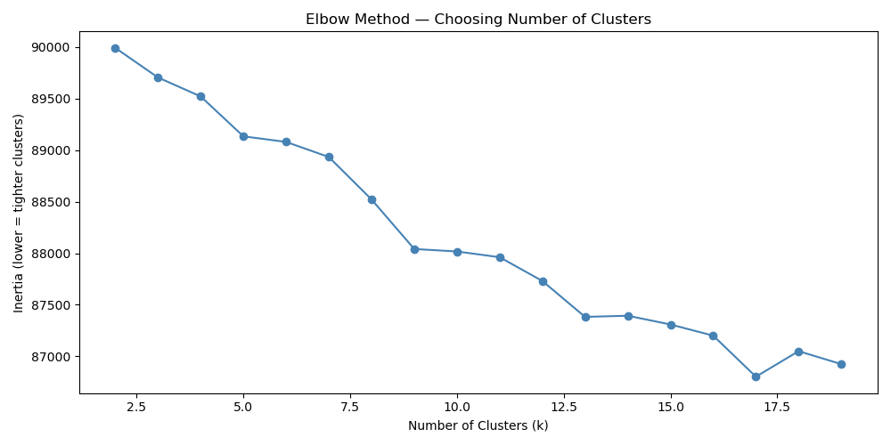
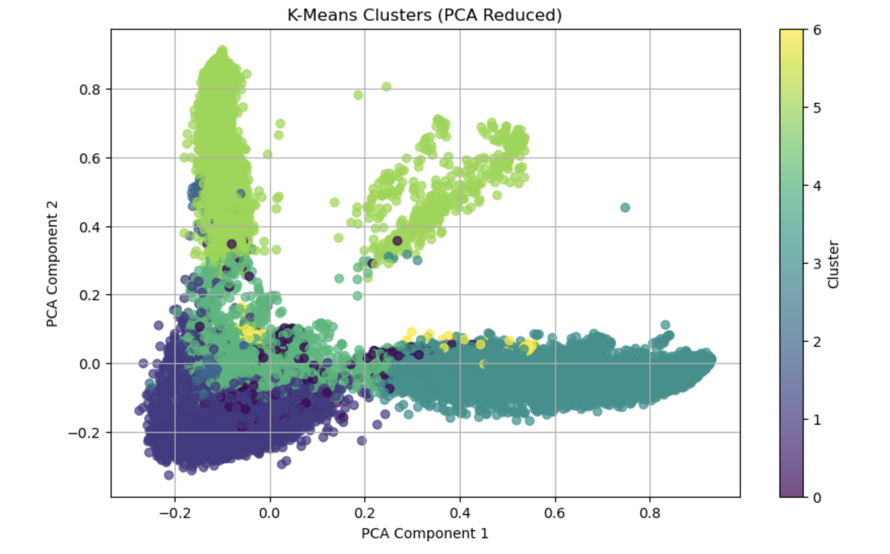
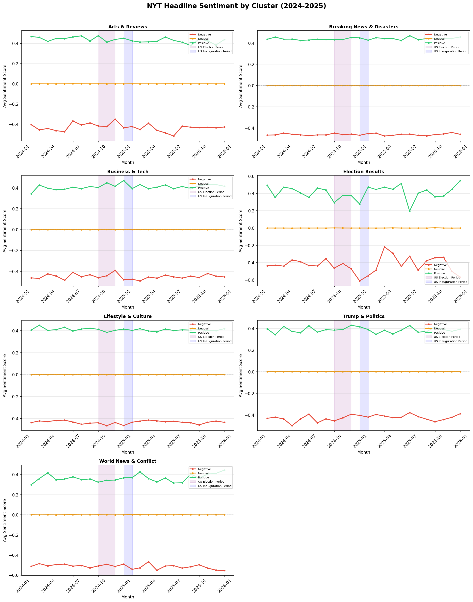
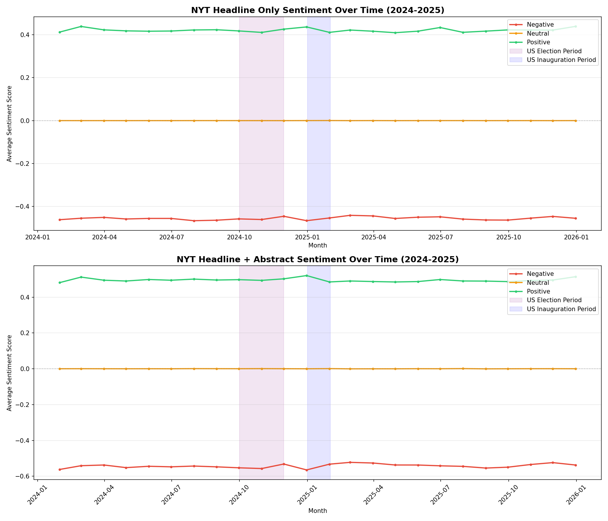

# Visualising the News
## How the New York Times Covered the US Election, Gaza and Trump's Return to the White House Through Machine Learning and Sentiment Analysis

### 🔗 [View the Interactive Streamlit App](https://nyt-headlines-analysis-6gsazhjdqry2xs9n2hcaam.streamlit.app/)

- K-Means clustering to identify seven thematic groups
- VADER sentiment analysis on headlines and abstracts
- Interactive timeline showing sentiment shifts around the US election and Trump's inauguration
- Filterable headline browser of all 96,510 headlines
- Built with: Python, Pandas, Scikit-learn, VADER, Streamlit, Matplotlib
  
---

## 📋 Summary

Analysing thousands of NY Times headlines for 2024 and 2025 provides insight into how one of the world’s leading news organisations is framing global events for public consumption. This project analyses 96,510 headlines using unsupervised machine learning and natural language processing to uncover hidden patterns in coverage and tone. K-means clustering identifies seven thematic groups, such as Trump & Politics, while VADER sentiment analysis tracks whether coverage skews positive, negative or neutral and when these tones shift over time. 

The project's findings reveal that World News & Conflict are by far the most negatively framed cluster, with sentiment declining throughout 2025. Trump & Politics is the most volatile cluster, shifting noticeably more negatively during the US election and inauguration. By contrast, Lifestyle & Culture and Breaking News & Disasters remain flat throughout 2024 and 2025, appearing to be unaffected by the negative clusters. A further finding suggests that headlines understate the negativity of articles compared to when article abstracts are added to the analysis pointing to a conscious editorial decision to neutralise headlines. All findings are presented through an interactive Streamlit app, making the analysis accessible to a non-technical audience.

---

## 📦 Data Collection & Preprocessing

Data for this project was collected using the NY Times API from the newspaper's developer portal, resulting in 96,510 rows and eight columns scraped for headline, date, month, section, author, URL, abstract and year for 2024 and 2025.

Cleaning of data consisted of removing rows with null values and duplicate entries. Text preprocessing was applied to the headline column using the Natural Language Processing (NLP) library, removing stop words (words such as "and", "the" and "was"), punctuation and special characters. All headlines were converted to lowercase to allow for consistency across the dataset. Sections of the newspaper were also removed — Crosswords & Games, News Briefings, Corrections, Summaries and Word of the Day — which were identified as not relevant to the analysis.

---

## 📊 Modelling, Exploratory Data Analysis & Sentiment Analysis

Headlines were converted into numerical vectors using TF-IDF (Term Frequency-Inverse Document Frequency) to measure how important headline words are relative to the entire dataset. To determine the optimal number of clusters, the Elbow Method was applied, measuring how tightly grouped headlines are within each cluster. As shown in the elbow plot, the curve does not produce a sharp bend, rather it gradually curves downward. However, a subtle shift at k=7 suggested this as the optimal number of clusters.

The final K-Means model was run with seven clusters, producing the following thematic groups: World News & Conflict, Lifestyle & Culture, Arts & Reviews, Trump & Politics, Breaking News & Disasters, Business & Tech and Election Results.

Sentiment analysis was applied using VADER (Valence Aware Dictionary and Sentiment Reasoner), a rule-based NLP tool designed to analyse social media posts. Although headlines are not social media, they are short and punchy, making VADER a viable tool for this analysis. Sentiment scores are classified as follows:

- **Positive:** score ≥ 0.05
- **Neutral:** score > -0.05 and < 0.05
- **Negative:** score ≤ -0.05

VADER was applied twice — first to headlines alone, then to headlines combined with article abstracts — to explore whether adding more text revealed shifts in sentiment that headlines alone could not capture. The headline-only analysis suggests the newspaper is more neutral in tone than the full picture reveals. When headlines and abstracts were combined, negative sentiment dropped significantly, reaching -0.58 compared to -0.45 for headlines alone, suggesting that editors consistently soften headline language relative to the story itself.

When sentiment was broken down by cluster, the contrast became clearer. World News & Conflict was by far the most negative cluster throughout 2024 and 2025, while Lifestyle & Culture remained almost entirely flat.  This suggests that neutral headlines in Lifestyle & Culture had been making negative headlines in World News & Conflict and Trump & Politics less visible.

---

## 🔭 Next Steps

- **Extending the dataset into 2026** to analyse coverage of the Iran conflict and emerging geopolitical tensions, and to explore whether the downward trend in World News & Conflict sentiment identified in 2025 continued or accelerated.
- **Separating opinion pieces** to compare how the NYT frames events editorially versus how they are covered in straight news reporting.
- **Using a more sophisticated sentiment tool** — while VADER proved a useful starting point, models such as RoBERTa or FinBERT would be better equipped to handle the nuance of news language, particularly for politically charged coverage.
- **Removing obituaries** — their volume only became apparent once the data was deployed to the Streamlit app, and their presence may have skewed certain clusters.

---

## 🎯 Conclusion

One of the most valuable outputs of this project was the Headline Browser in the Streamlit App, which allows users to filter by cluster, sentiment and keyword simultaneously. For example, filtering by Trump & Politics, positive sentiment and searching for "Moscow" returns a single headline: *"In Moscow, Trump's Victory is Welcome, but Warily"* — a result that would not have been possible to surface through a conventional search engine. Similarly, filtering Arts & Reviews by negative sentiment reveals the dismissal of the musical adaptation of Prince's Purple Rain. This interactive exploration transforms a flat data report into a genuine investigative tool that could be applied to any news research project.

But is the New York Times neutral? At headline level, the newspaper suggests more editorial neutrality than may actually exist. When article abstracts are examined — particularly in clusters like Trump & Politics and World News & Conflict — a more negative picture emerges than when analysing headlines alone, suggesting that headline language is consistently softened relative to the fuller story.

Extending the methodology used in this project to compare multiple news organisations, or tracking sentiment across a longer period of time, could provide a powerful lens for examining media bias. What began as an exercise in unsupervised machine learning and natural language processing has confirmed something more fundamental: that the way newspapers are edited can shape how readers interpret events, and that media organisations carry a responsibility when shaping public opinion.

---

## 📁 Data Source
- New York Times Developer API
- 96,510 headlines — January 2024 to December 2025
